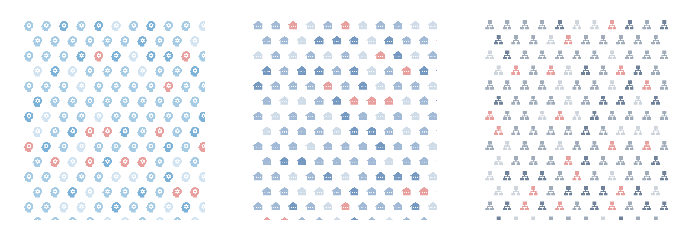
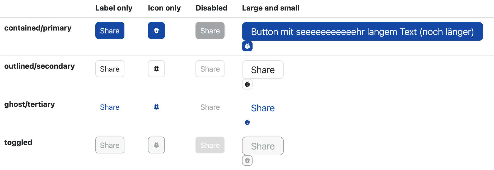
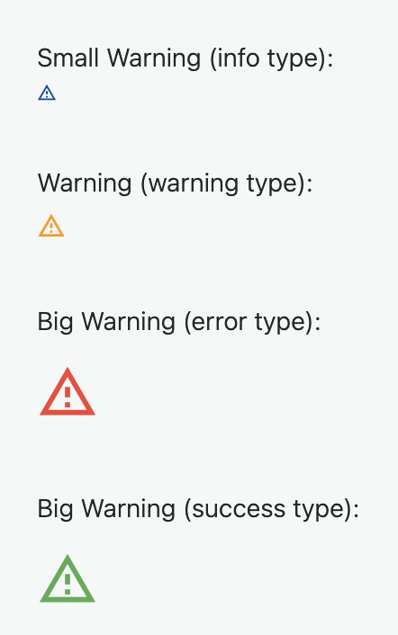

# SvelteKit Tiny Project starter

Hi, I´m Nika, and this is one of my playgrounds. 

It contains a basic project structure, some TypeScript wrappers for Svelte interfaces, some basic UI components and a 
hexagon pattern with Icons. Enjoy! 

### Hexagon pattern

### Two examples of styled components

